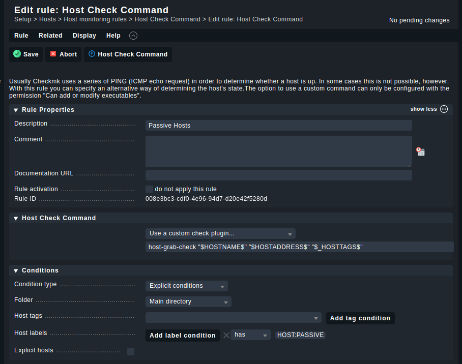
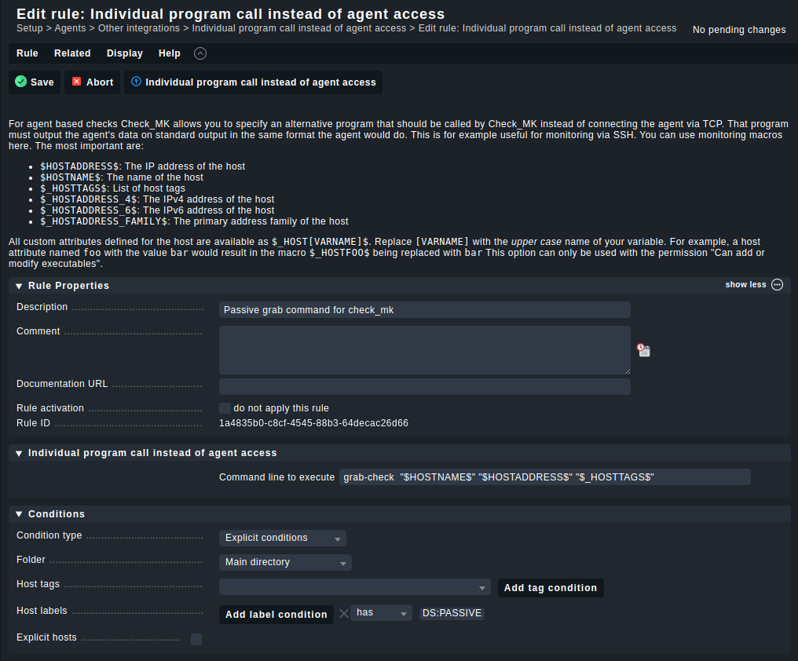

## Host Check Command

```
host-grab-check "$HOSTNAME$" "$HOSTADDRESS$" "$_HOSTTAGS$"

# Label: HOST:PASSIVE
```




##

```
grab-check  "$HOSTNAME$" "$HOSTADDRESS$" "$_HOSTTAGS$"

# Label: DS:PASSIVE"
```


